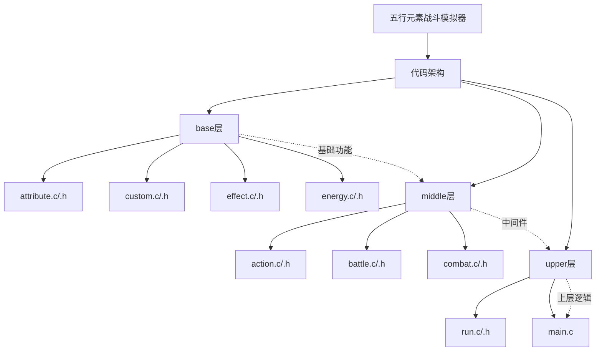
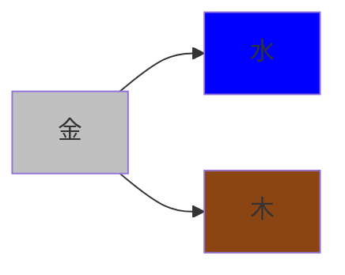
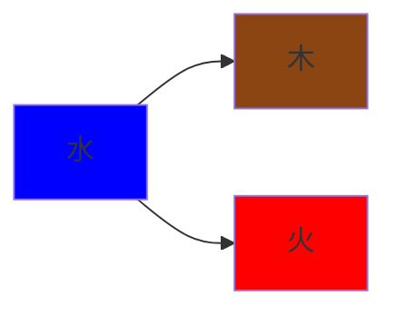
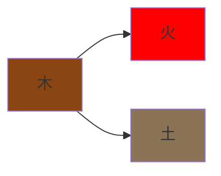
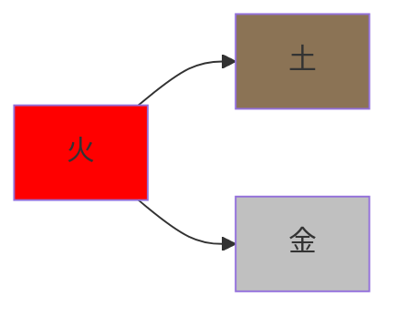
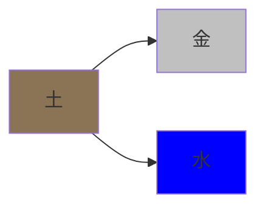
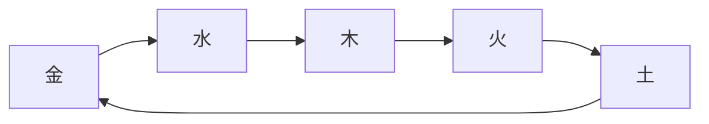
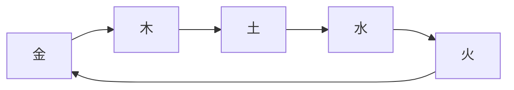

# 五行元素战斗模拟器

这是一个基于C语言的五行元素战斗模拟器项目，通过编程实现金木水火土五行相生相克的战斗系统和角色成长机制。

## 项目概述

本项目模拟了五行元素世界中的战斗场景，包含元素属性系统、能量系统、战斗机制等核心功能。支持三种运行模式：

- **模拟模式**：自动运行战斗模拟
- **交互模式**：单人交互式战斗
- **战斗模式**：双人对战模式

## 项目结构



## 核心功能

### 1. 属性系统
- 元素属性管理
- 属性升级系统
- 随机属性提升
- 预设属性配置

### 2. 能量系统
- 能量值管理
- 能量恢复机制
- 能量消耗计算

### 3. 战斗系统
- 战斗回合机制
- 技能释放系统
- 伤害计算
- 状态效果处理

### 4. 运行模式
- 模拟模式：自动运行战斗
- 交互模式：单人交互式战斗
- 战斗模式：双人对战

## 技术特点

- **模块化设计**：清晰的分层架构，便于维护和扩展
- **多线程编译**：Makefile支持多线程编译，提升构建速度
- **跨平台兼容**：使用标准C语言编写，支持多种平台
- **可扩展性**：模块化设计便于添加新功能和角色

## 构建与运行

### 环境要求
- MinGW GCC编译器
- Windows操作系统（支持UTF-8编码）

### 构建步骤
1. 安装MinGW并配置环境变量
2. 在项目根目录运行：
   ```bash
   make
   ```
3. 生成可执行文件 `execute.exe`

### 运行方式
```bash
# 模拟模式（默认）
./execute.exe

# 交互模式（单人）
./execute.exe 1

# 战斗模式（双人）
./execute.exe 1 2
```

## 项目特色

1. **五行元素主题**：融入金木水火土五行元素，包含相生相克机制
2. **策略性战斗**：通过元素搭配和技能选择实现策略战斗
3. **成长系统**：元素通过战斗获得经验，提升属性
4. **多人对战**：支持双人对战模式，增加游戏乐趣

## 代码设计中的五行哲学思想

本项目通过C语言编程实现五行元素的战斗系统，将中国古代哲学思想与现代编程技术相结合。代码设计体现了以下哲学理念：

### 1. 模块化设计体现"整体观"
- **base层**：基础功能模块，如同五行的根基
- **middle层**：中间件层，如同五行之间的相互作用
- **upper层**：上层逻辑，如同五行的显现形式

### 2. 数据结构体现"元素特性"
```c
typedef struct {
  char name[32];
  EnergyType type;        // 元素类型
  int level;              // 等级
  int health;             // 生命值
  int capacityBase;       // 基础容量
  int capacityExtra;      // 额外容量
  int attackBase;         // 基础攻击
  int attackOffset;       // 攻击偏移
  int defenceBase;        // 基础防御
  int defenceOffset;      // 防御偏移
  CombatEffect effects[EFFECT_ID_COUNT];  // 战斗效果
} Energy;
```

### 3. 元素特性与五行哲学的对应

#### 🔩 金元素 (METAL)


- **代码实现**：
```c
case METAL:
  energy->capacityBase = 128;
  energy->attackBase = 32;
  energy->defenceBase = 32;
  energy->effects[strengthen].value = 0.5;  // 强化效果
  energy->effects[strengthen].type = true;
  break;
```
- **哲学对应**：金的坚硬特性体现在高攻击和防御平衡上，"强化"效果体现金的收敛特性

#### 🌊 水元素 (WATER)


- **代码实现**：
```c
case WATER:
  energy->capacityBase = 160;  // 高生命值
  energy->attackBase = 16;     // 低攻击
  energy->defenceBase = 64;    // 高防御
  energy->effects[adjustAttribute].value = 0.75;  // 属性调整
  energy->effects[adjustAttribute].type = true;
  break;
```
- **哲学对应**：水的包容特性体现在高生命值和防御上，"属性调整"体现水的适应性

#### 🪵 木元素 (WOOD)


- **代码实现**：
```c
case WOOD:
  energy->capacityBase = 256;  // 极高生命值
  energy->attackBase = 32;     // 中等攻击
  energy->defenceBase = 16;    // 低防御
  energy->effects[absorbBlood].value = 0.25;  // 吸血效果
  energy->effects[absorbBlood].type = true;
  break;
```
- **哲学对应**：木的生长特性体现在极高生命值上，"吸血"效果体现木的滋养特性

#### 🔥 火元素 (FIRE)


- **代码实现**：
```c
case FIRE:
  energy->capacityBase = 96;   // 低生命值
  energy->attackBase = 64;     // 极高攻击
  energy->defenceBase = 16;    // 低防御
  energy->effects[enchanting].value = 1.0;  // 附魔效果
  energy->effects[enchanting].type = true;
  break;
```
- **哲学对应**：火的炎热特性体现在极高攻击上，"附魔"效果体现火的转化特性

#### 🪨 土元素 (EARTH)


- **代码实现**：
```c
case EARTH:
  energy->capacityBase = 384;  // 最高生命值
  energy->attackBase = 16;     // 最低攻击
  energy->defenceBase = 0;     // 无防御
  energy->effects[accumulateAnger].value = 0.5;  // 积累怒气
  energy->effects[accumulateAnger].type = true;
  break;
```
- **哲学对应**：土的包容特性体现在最高生命值上，"积累怒气"体现土的蕴藏特性

### 4. 战斗机制体现"相生相克"

#### 相生关系


#### 相克关系


### 5. 战斗算法体现"动态平衡"

#### 伤害计算算法
```c
int handleCalculateDamage(double attack, int defence, double coeff) {
  int damage = 0;

  if (defence > 0) {
    damage = round(attack * (attack / (attack + defence)) * coeff);
  } else {
    damage = round((attack - defence) * coeff);
  }

  return damage;
}
```
- **哲学意义**：体现了"攻守平衡"的哲学思想，攻击和防御相互制约

#### 属性调整算法
```c
void handleAdjustByDamage(Energy *energy, int damage, int damageType) {
  // 根据受到的伤害调整属性
  int adjustValue = round(energy->defenceBase * damageRatio * pow(healthRatio + 0.3, 6.2));
  energy->defenceOffset -= adjustValue;
  energy->attackOffset += round(adjustValue * effect->value);
}
```
- **哲学意义**：体现了"物极必反"的哲学思想，受损后会激发潜力

## 战斗策略

在游戏中，理解五行相生相克关系至关重要：

- **进攻策略**：选择克制对手的元素以获得优势
- **防御策略**：使用被克制的元素时需更加谨慎
- **团队搭配**：合理搭配相生的元素以形成互补
- **环境利用**：根据战斗环境选择有利的元素

## 未来开发计划

- [ ] 添加更多元素技能
- [ ] 完善五行相生相克系统
- [ ] 增加元素自定义功能
- [ ] 添加存档/读档功能
- [ ] 优化战斗动画效果
- [ ] 支持网络对战模式

## 元素特性详解

### 🔩 金元素 (METAL)
- **代码特性**：`capacityBase=128, attackBase=32, defenceBase=32`
- **相生关系**：金生水 - 金的强化效果可以提升水的防御能力
- **相克关系**：金克木 - 金的高攻击可以突破木的生命优势
- **战斗风格**：高攻击、穿透力强

### 🌊 水元素 (WATER)
- **代码特性**：`capacityBase=160, attackBase=16, defenceBase=64`
- **相生关系**：水生木 - 水的调整属性可以增强木的生命恢复
- **相克关系**：水克火 - 水的调整属性可以削弱火的高爆发
- **战斗风格**：控制、持续伤害

### 🪵 木元素 (WOOD)
- **代码特性**：`capacityBase=256, attackBase=32, defenceBase=16`
- **相生关系**：木生火 - 木的吸血效果可以维持火的持续输出
- **相克关系**：木克土 - 木的生命恢复可以抵消土的无防御
- **战斗风格**：恢复、增益

### 🔥 火元素 (FIRE)
- **代码特性**：`capacityBase=96, attackBase=64, defenceBase=16`
- **相生关系**：火生土 - 火的附魔效果可以提升土的攻击潜力
- **相克关系**：火克金 - 火的附魔可以穿透金的强化防御
- **战斗风格**：高爆发、范围伤害

### 🪨 土元素 (EARTH)
- **代码特性**：`capacityBase=384, attackBase=16, defenceBase=0`
- **相生关系**：土生金 - 土的怒气积累可以增强金的强化效果
- **相克关系**：土克水 - 土的怒气可以突破水的防御体系
- **战斗风格**：防御、减伤

## 贡献指南

欢迎提交Issue和Pull Request来改进本项目。在提交代码前，请确保：

1. 代码符合项目编码规范
2. 通过现有测试用例
3. 更新相关文档

## 开源协议

本项目采用MIT协议开源。

## 联系方式

如有问题或建议，请通过GitHub Issues提交。

---

*项目灵感来源于五行元素理论，旨在通过编程实践加深对C语言的理解和掌握。*